## 第一章

### 什么是分布式事务？可否用银行转账来说明下？

### 事务的四个特征是什么，距离说明下？

### 事务隔离级别有哪些，代表什么含义？你们系统中用的是哪个事务隔离级别，为什么？

### 什么是脏读，不可重复读，幻读

http://www.cnblogs.com/phoebus0501/archive/2011/02/28/1966709.html

### 怎么防止幻读带来的问题？（update ... 看是否更新到了，从而进行判断）

### 通过事务保证一致性，就会影响系统的可用性，如何解决这类问题？

### 什么是CAP定理，什么是BASE理论？

CAP: Consistency, Availability, Partition tolerance

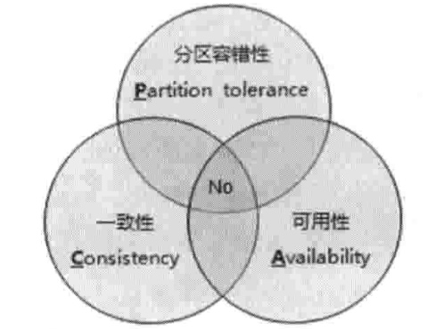

BASE: Basically Availabel, Soft state, Eventually consistent.

### 放弃CAP其中一个特性会有什么问题，哪个特性是分布式服务必须具有的？

### 最终一致性有哪些变种? 举个最终一致性的例子

### BASE与ACID有哪些区别？具体使用的时候怎么考虑两者

## 第二章 一致性协议

### 为什么要引入2PC（Two-Pahse Commit），阐述一下2PC的执行过程。

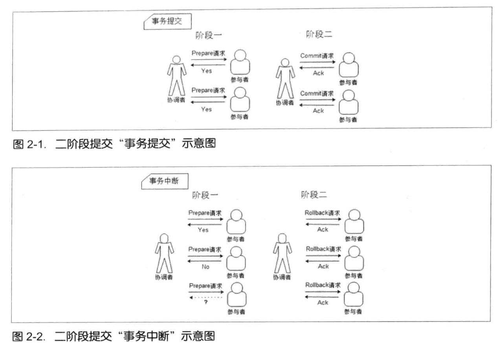

### 二阶段事务提交有什么优缺点？

### 为什么要引入3PC，阐述一下3PC的执行过程。

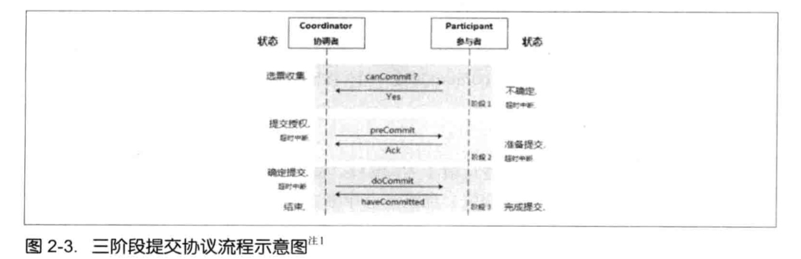

### 3PC比起2PC有什么优点？仍然存在什么问题？

### Paxos分布式一致性算法为什么会出现，解决了什么问题？执行原理是怎样的？
拜占庭将军问题  兼职会议

## Zookeeper与Paxos

### Zookeeper与Master/Slave的集群模式有什么区别

### 关于Zookeeper的选举

选举机制(FastLeaderElection算法)：sid最大且被超过集群中超过半数的机器拥护就会成为leader.
所以只有两种情况无法选出leader：

	.	整个集群只有2台服务器（注意不是只剩2台，而是集群的总节点数为2）

	.	整个集群超过半数机器挂掉。


 所谓的偶数问题其实是另一个集群优化配置问题，即:集群的容灾数量=集群总节点数/2-1
假如集群有5节点，那么最多允许2个节点挂掉，如果有3节点挂了，那么整个集群的选举结果不会满足条件：集群中超过半数的机器拥护。
假如集群有6个节点，那么最多也只能挂掉2台，因为挂了3台时，选举结果也不会满足条件:集群中超过半数的机器拥护。
结果可以看出，多那一台用处并不大。所以集群总数推荐为奇数。

## 使用Zookeeper

### 说说MySQL的数据复制组件的工作流程和架构？

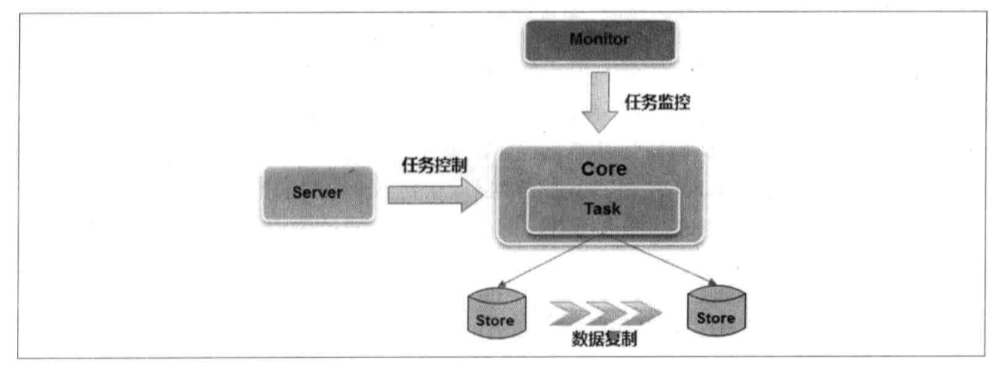

### MySQL数据复制组件冷热备份对比？

热备份：实时，比较耗机器资源；
冷备份：类备份扫描，不实时，节省机器资源；

### 单一台MySQL服务器无法保证高可用

### 分布式系统大部分的性能瓶颈在数据库操作上，有什么方法取代使用数据库的排他性（如行锁，表锁或者事务）造成的性能问题呢？

* zookeeper 排它锁 共享锁

zookeeper可以通过数据节点来表示一个锁

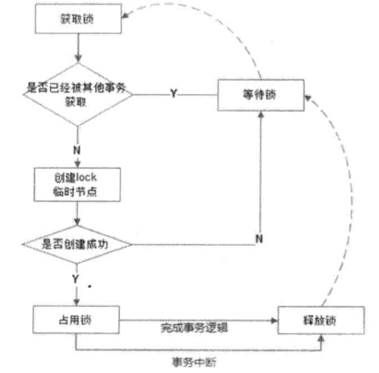

排它锁的流程

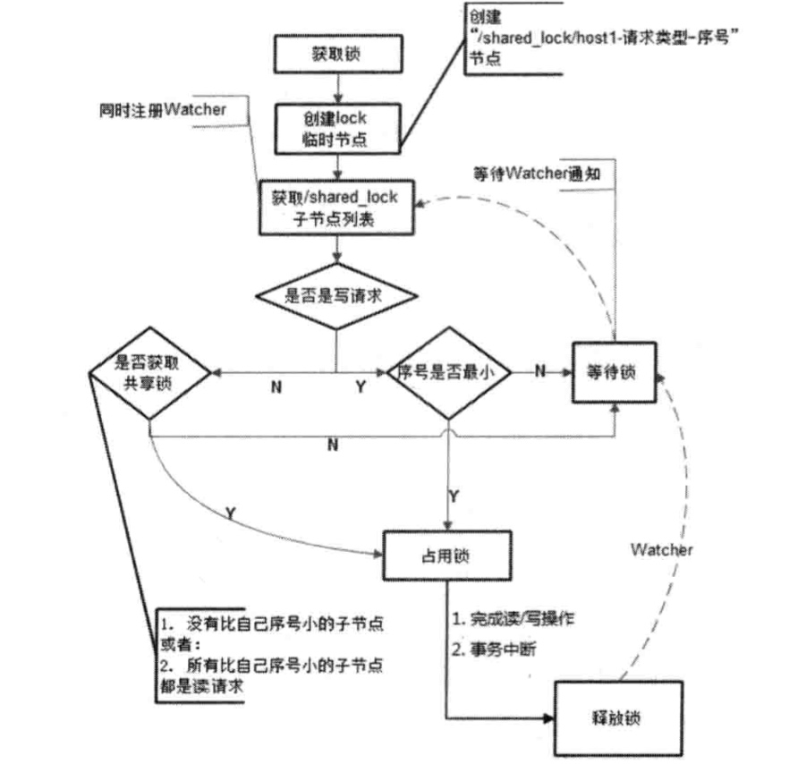

共享锁的流程

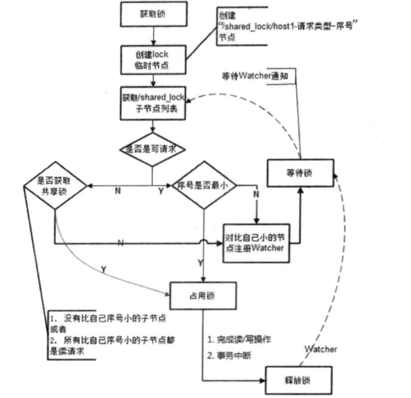

优化羊群效果后的流程图

JDK synchronized  ReentrantLock

Redis  mc
redis集群  高可用

通过Future的方式，先并发向5个节点请求，再一起获得响应结果，能缩短响应时间，不过还是比单节点redis锁要耗费更多时间。

[聊一聊分布式锁的设计](http://weizijun.cn/2016/03/17/%E8%81%8A%E4%B8%80%E8%81%8A%E5%88%86%E5%B8%83%E5%BC%8F%E9%94%81%E7%9A%84%E8%AE%BE%E8%AE%A1/)


### 常见的分布式队列有哪些，有哪两种模型

ActiveMQ，Kafka

先入先出，Barrier模型

### ZooKeeper实现的主备切换一般流程是怎样的？

1. 创建锁节点
2. 注册Watcher监听
3. 主备切换

### 什么是分布式脑裂（brain-Split）现象，怎么解决这类问题？

网络，GC等导致假死问题产生选举了另一个Master，同事出现两个Master各司其职；

Fencing(隔离)：创建的跟节点必须携带ZooKeeper的ACL信息

### Kafka使用四层负载均衡和使用ZooKeeper进行负载均衡的区别是什么？

### 不能基于临时节点来创建子节点，只能作为叶子节点

### ZooKeeper的版本号是用来干嘛的？

从乐观锁说起，乐观锁控制事务分为三个阶段：数据读取、写入校验、数据写入。 CAS


### 说说ZooKeeper的数据变更通知的流程

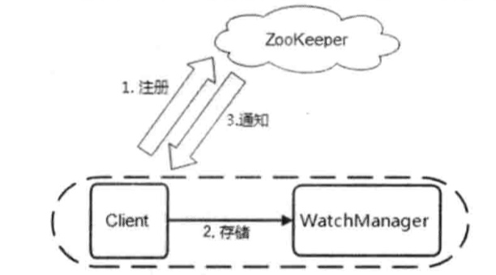

Client向Zk注册Watcher，同时将Watcher对象存储在客户端的WatchManger中，服务器端先生成WatcherEvent事件对象，序列化传输，客户端把WatcherEvent还原成WatchedEvent对象，调用Watcher中的回调函数进行处理：process(WatchedEvent event);

**下面看看Watcher的注册流程：**

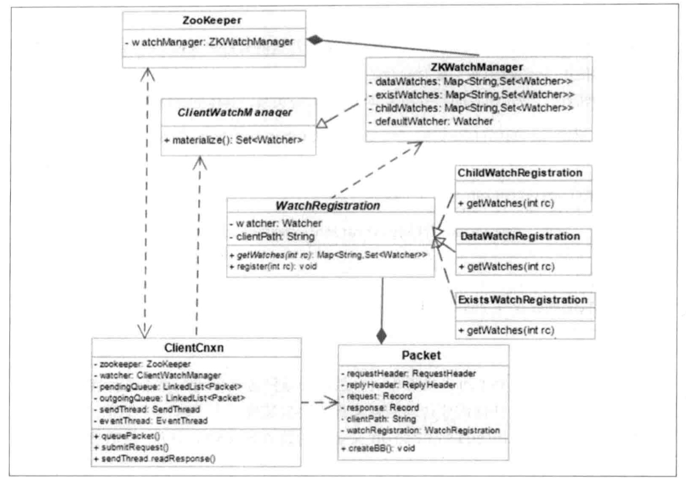
	
创建ZooKeeper客户端实例的时候（getData，getChildren，exist也可以）传入Watcher，会一直保存在客户端ZKWatchManager的defaultWatcher中，作为整个ZooKeeper会话期间的默认Watcher。

**客户端发送Watcher**

```
--> 标记request为使用Watcher监听 --> 封装WatchRegistration对象（保存数据节点和Watcher的对应关系） --> 在ClientCnxn把WatchRegistration封装到Packet中 --> 放入发送队列等待客户端发送 --> SendThread.readResponse方法负责接收来自服务端的响应 --> finishPacket方法从Packet中取出对应的Watcher注册到ZKWatchManger中。（从WatchRegistration对象中提取出Watcher，保存在ZKWatchManger的dataWatches中，dataWatches的key是数据节点的路径。）
```

底层实际传输的过程中，并没有将WatchRegistration序列化到底层数组中。

**服务器端处理Watcher**

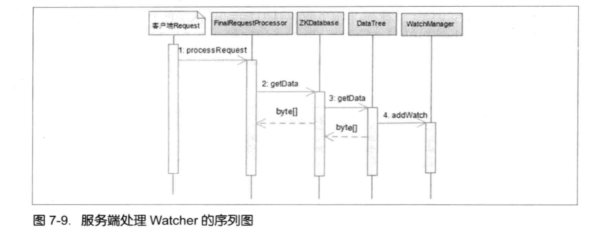

FinalRequestProcessor.processRequest中判断是否需要注册Watcher --> 需要注册，则将ServerCnxn对象和数据节点路径传入getData方法。（ServerCnxn代表着一个客户端和服务器的连接，实现：NIOServerCnxn，NettyServerCnxn，并实现了process方法，可以把ServerCnxn看成Watcher对象） --> 数据节点路径和ServerCnxn最终存储在WatchManger的WatchTable和watch2Paths中。

**Watcher事件触发**

WatchManager负责Watcher事件触发，并移除已经被触发的Watcher：
1. 封装WatchedEvent
2. 查询Watcher
3. 调用ServerCnxn的process方法来触发
> 请求头是-1，表明当前是一个通知；
> 将WatchedEvent包装成WatcherEvent对象，以便于网络传输序列化；
> 向客户端发送通知

**客户端回调Watcher**

SendThread.readResponse()接收事件通知，如果响应头标识了XID为-1，则表明是一个通知类型的响应，处理流程：

> 反序列化；
> 处理chrootPath；
> 还原WatchedEvent；
> 回调Watcher；

**Watcher特性**

一次性；
客户端串行执行；
轻量；

### ZooKeeper如何保证数据安全？

通过ACL机制，常用的`权限模式`：

* IP
* Digest(username:passowrd SHA-1加密 BASE64编码)
* World(最开放权限控制模式，特殊的Digest模式：world:anyone)
* Super(超级用户，特殊的Digest模式)

通过ACL授权给一个客户端的节点，但是该客户端已经退出不用的情况下，只能使用Super模式清理节点。

### 常用的序列化组件有哪些？

Jute，是ZooKeeper中的序列化组件，Hadoop最初的默认序列化组件，前身是Hadoop Record IO；
Apache Avro，具有出众的跨语言特性，丰富的数据结构，对MapReduce的天生支持，可以方便地用于RPC，后来Hadoop采用该框架进行序列化；

### ZooKeeper的通信协议是怎样的？

基于TCP/IP协议，ZooKeeper实现了自己的通信协议来完成客户端与服务端、服务端与服务端之间的网络通信。

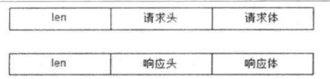

**协议解析：请求部分**

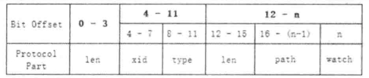

请求头：RequestHeader: xid  type
请求体：ConnectRequest，GetDataRequest，SetDataRequest

**协议解析：响应部分**

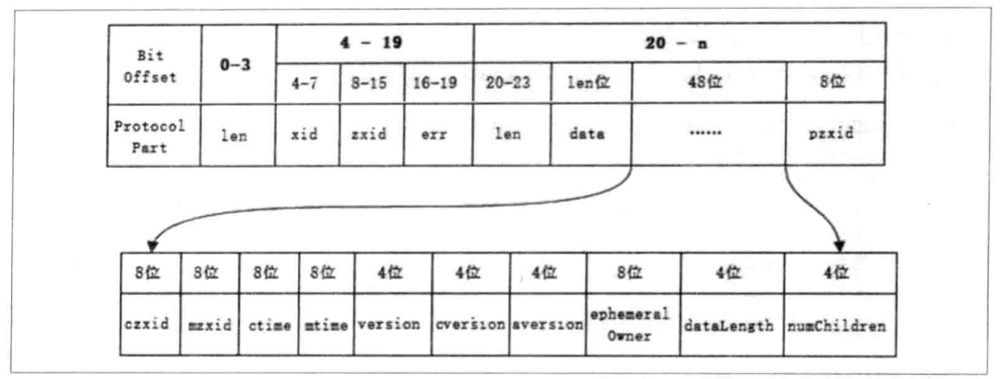

响应头：RepayHeader: xid zxid err
响应体：ConnectResponse，GetDataResponse，SetDataResponse

### ZooKeeper的核心组件以及客户端的初始化和启动过程

* ZooKeeper实例
* ClientWatchManager
* HostProvider
* ClientCnxn
    * SendThread: I/O线程
    * EventThread: 事件线程

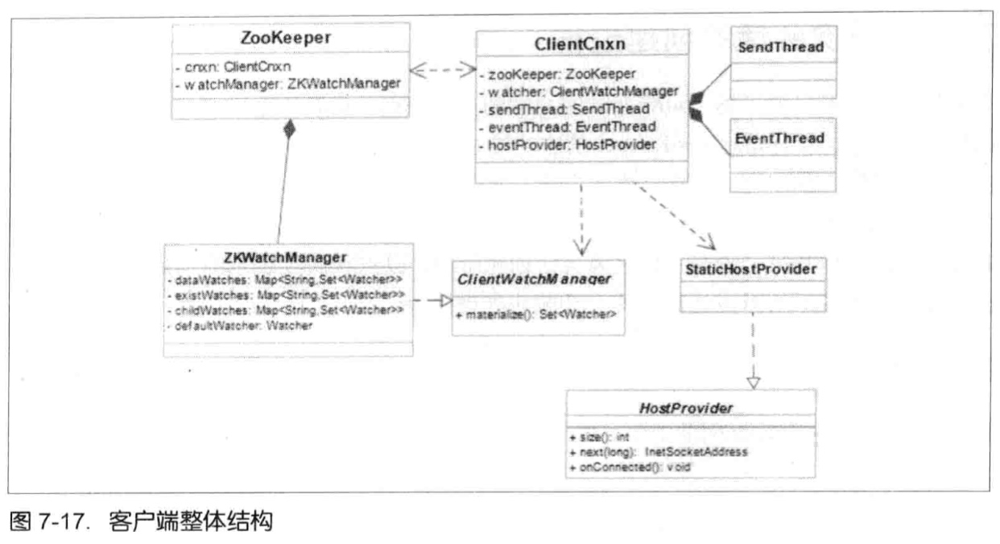

客户端初始化和启动过程：1、设置默认Watcher；2、设置ZooKeeper服务器地址列表；3、创建ClientCnxn；

### ClientCnxn网络I/O具体流程

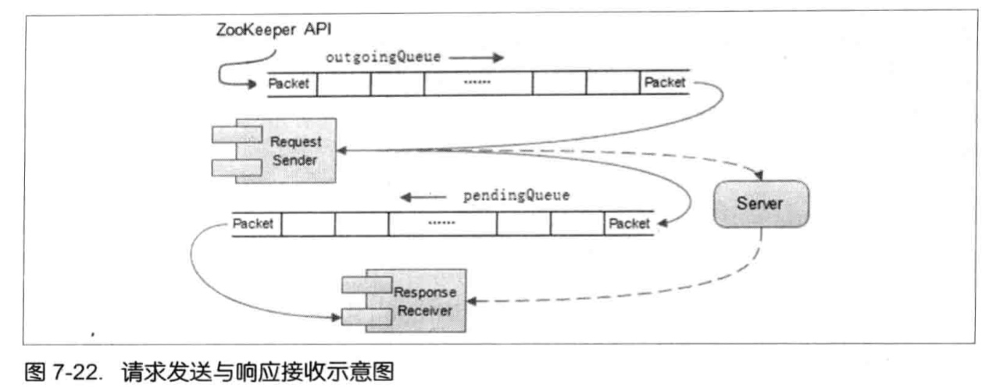

关键概念：Packet  ClientCnxn  outgoingQueue  pengdingQueue  ClientCnxnSocket  SendThread  EventThread


### 谈谈ZooKeeperSessionId的生成算法

### ZooKeeper中的超时检查机制是怎样的，这样的机制有什么好处？

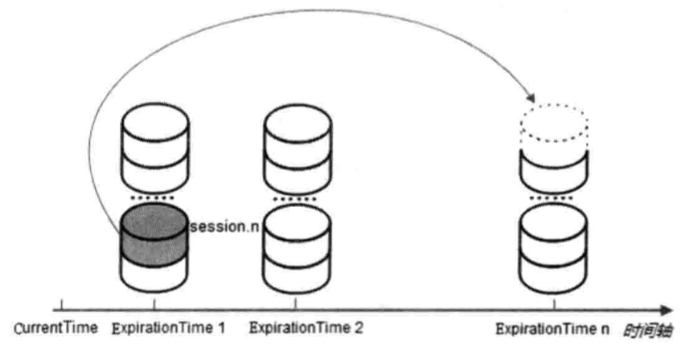

ExpirationInterval

### ZooKeeper中的清理会话的机制是怎样的？

### 重连机制是怎样的？

长连接是通过心跳机制实现的；

### 会话转移可能会导致什么问题？

网络延时，会话转移的过程中，导致先发送的请求写入的节点数据覆盖了后面发送的请求写入的节点数据。解决方法：判断客户端请求的Owner是不是当前服务器

### 谈谈ZooKeeper的整体架构

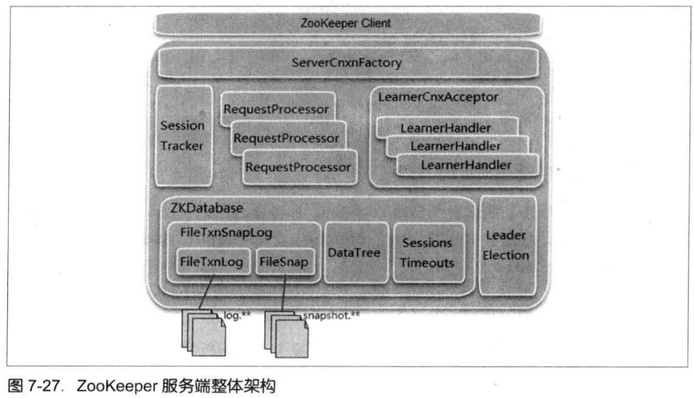


### ZooKeeper启动流程

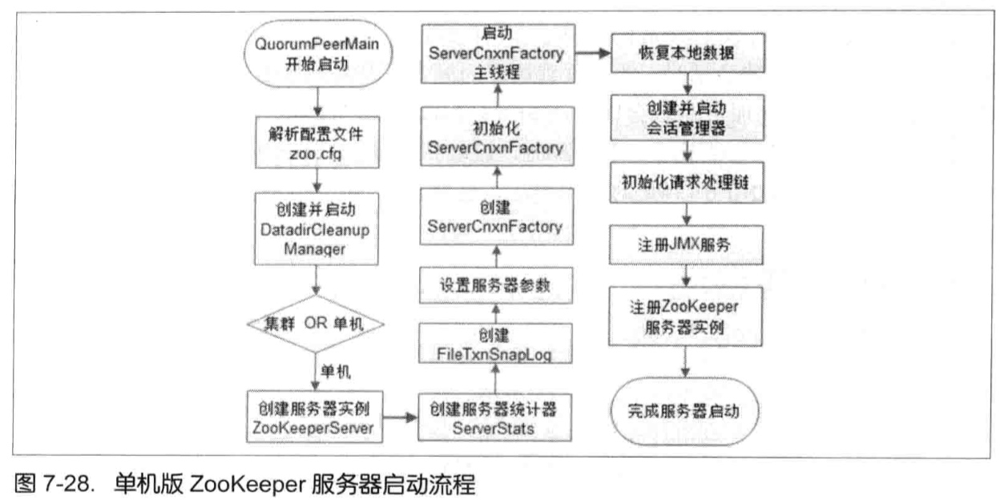

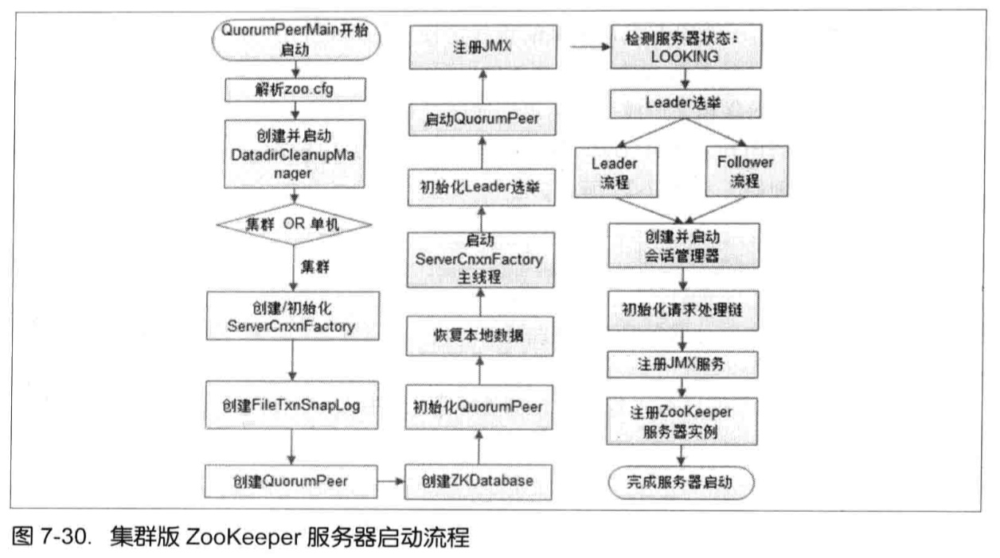

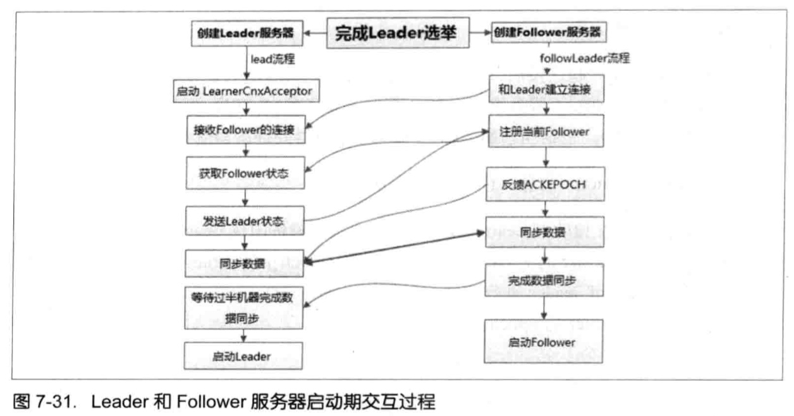


### ZooKeeper的选举流程

ZooKeeper中提供了三种选举算法：LeaderElection，UDP版本的FastLeaderElection，TCP版本的FastLeaderElection（3.4开始只保留这个选举算法）。

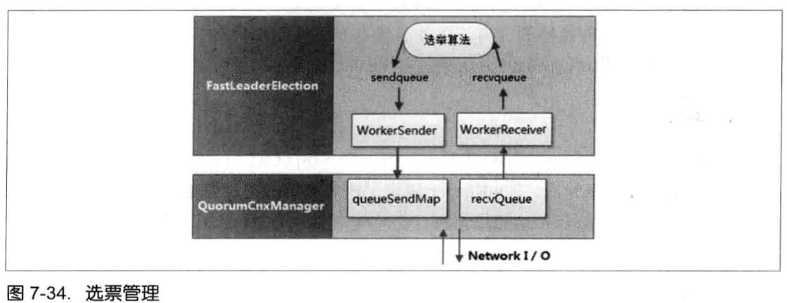

sendqueue：选票发送队列
recvqueue：选票接收队列
WorkerReceiver：选票接收器


**Leader选举算法实现的流程示意图**
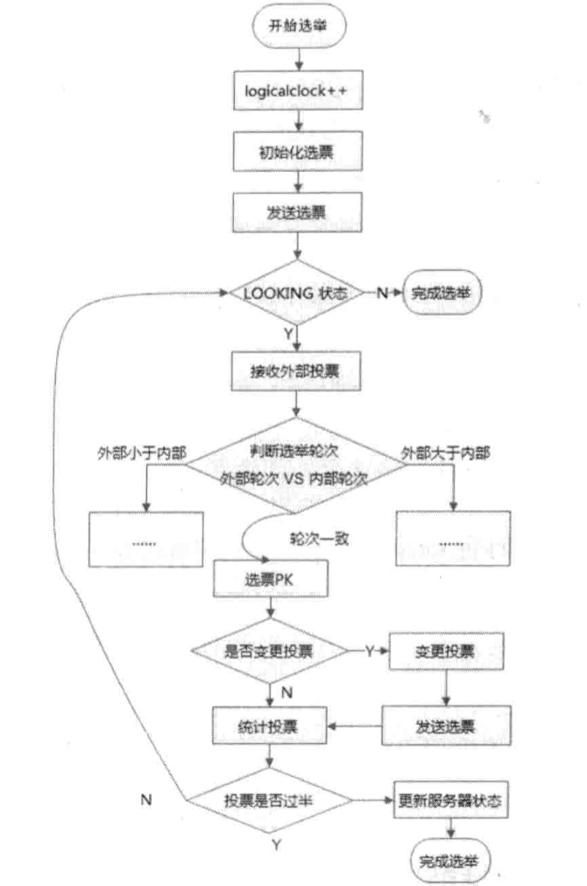


### 各个服务器角色介绍

**Leader**

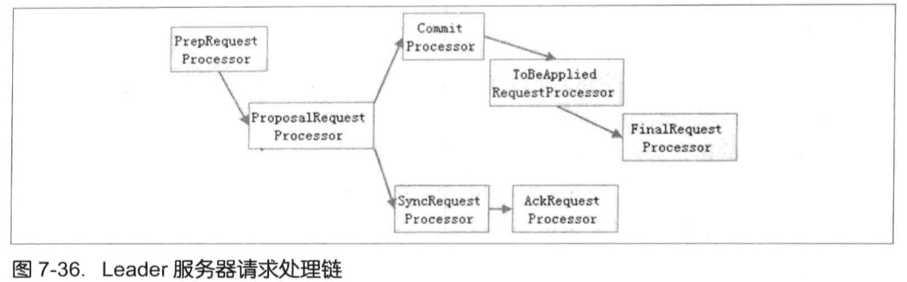

PreRequestProcessor：预处理器，对事务请求进行一系列预处理；
ProposalRequestProcessor：事物投票处理器，非事务请求直接提交到CommitProcessor;

CommitProcessor：事务提交处理器，非实物请求直接交付给下一级处理器；
ToBeCommitProcessor：包含一个toBeApplied队列，包含可被提交的Proposal，并叫一个下一个处理器进行处理；
FinalRequestprocessor：收尾工作：创建客户端请求的响应，针对事务请求，将事务应用到内存数据库中去；

SynRequestProcessor：事务日志记录处理器；
AckRequestProcessor：Leader特有的处理器，通知投票收集器当前服务器已经完成了对该Proposal的事务日志记录；

Leader服务器会为所有的Follower/Observer服务器建立TCP长连接，同时为每个Follower/Observer服务器创建一个名为LearnHander的对象。

**Follower**

处理客户端非事务请求，对于事务请求，直接转发给Leader进行处理；参与事务请求Proposal投票，参与Leader选举投票；

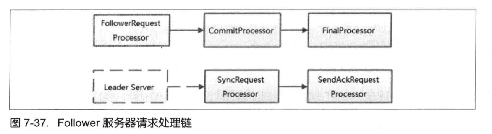

FollowerRequestProcessor: 转发事务请求给Leader进行处理

SendAckRequestProcessor: Follower才有该处理器，以ACK消息的形式来向Leader服务器进行反馈。

**Observer**

Observer与Follower的区别：Observer不参与任何形式的投票（事务请求Proposal和Leader选举的投票），只提供非事务服务，通常用于在不影响集群事务处理能力的前提下提升集群的非事务处理能力。

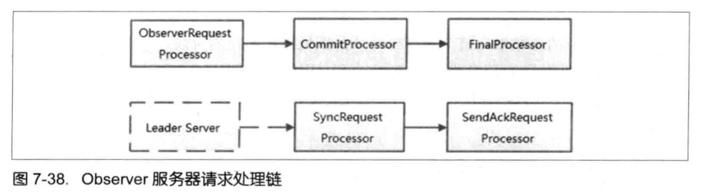

注意：Leader服务器不会将事务请求的投票发送给Observer服务器。

### 集群间消息通信有哪些类型

**数据同步型**

**服务器初始化型**

**请求处理型**

**会话管理型**

[分布式理论之一：Paxos算法的通俗理解](http://www.cnblogs.com/esingchan/p/3917718.html)

[Paxos算法与Zookeeper分析](http://blog.csdn.net/xhh198781/article/details/10949697)


 


