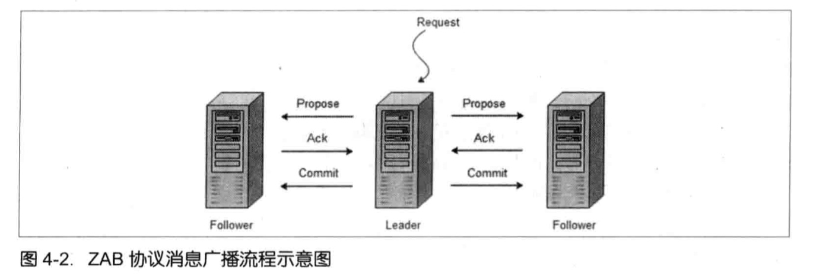
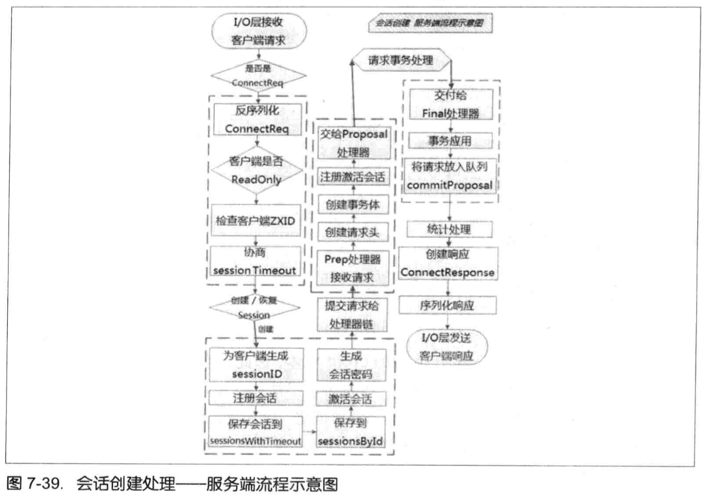
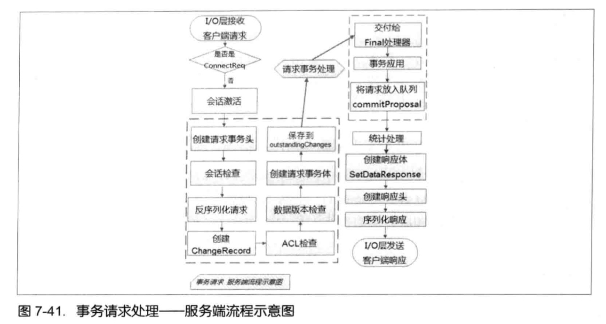
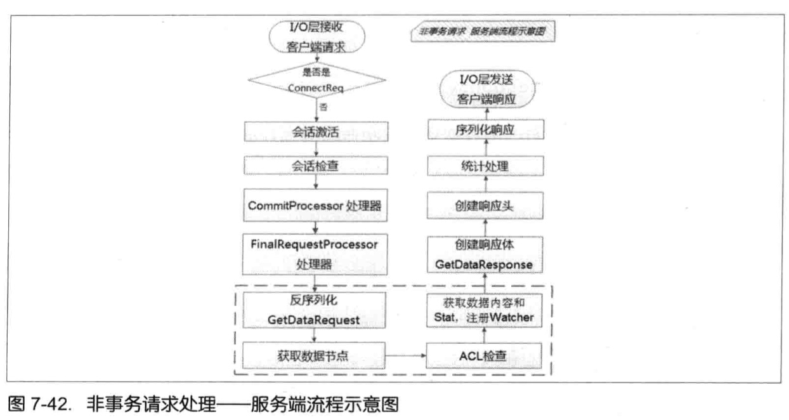

## 第一章

### 什么是分布式事务


### 什么是CAP定理，什么是BASE理论？

CAP: Consistency, Availability, Partition tolerance


BASE: Basically Availabel, Soft state, Eventually consistent.

对于本地或者集中式事务，我们可以用很成熟的ACID模型来保证数据的严格一致性。而分布式系统，一致性和可用性无法同时得到保证。CAP既一个分布式系统无法同事满足一致性，可用性和分区容错性。

### 放弃CAP其中一个特性会有什么问题，哪个特性是分布式服务必须具有的？

### 最终一致性有哪些变种? 举个最终一致性的例子

### BASE与ACID有哪些区别？具体使用的时候怎么考虑两者

## 第二章 一致性协议

### 为什么要引入2PC（Two-Pahse Commit），阐述一下2PC的执行过程。


协调者协调参与者

### 二阶段事务提交有什么优缺点？

提交事务请求,执行事务提交.

原理简单,实现方便

同步阻塞,单点问题,脑裂(数据不一致),太过保守.

### 为什么要引入3PC，阐述一下3PC的执行过程。


2PC 提交事务请求分为两步.

CanCommit,PreCommit,DoCommit.

### 3PC比起2PC有什么优点？仍然存在什么问题？

一分为二后降低了阻塞范围,提前检测单点故障,使数据达成一致性.

如果进入阶段三之后出现了故障,最终超时之后,参与者的事务还是会自动提交,还是会导致数据不一致性的问题.

### Paxos分布式一致性算法为什么会出现，解决了什么问题？执行原理是怎样的？

拜占庭将军问题  兼职会议

Paxos要解决的问题是在一个分布式系统中,出现宕机或者网络异常,能够快速并且正确的在集群内对某个数据的值达成一致,无论发生什么异常,都不会破坏整个系统的一致性.

## 第三章 Paxos的工程实践

Chubby是一个分布式锁服务,以Paxos算法为基础.

**分布式锁服务具有的优点:**

* 对上层应用程序的侵入性小
* 便于提供数据的发布与订阅
* 开发人员对基于锁的接口更为熟悉
* 更便捷地构建更可靠的服务

**Chubby设计目标:**

* 提供一个完整的,独立的分布式锁服务,而非仅仅是一个一致性协议的客户端
* 提供粗粒度的锁服务

`与细粒度的锁的区别`:细粒度的锁通常设计为锁服务一旦失效就释放所有锁,但也可以设计更可靠的锁,通过redis集群或者zk实现.
    高可用的锁更安全:比如一个线程获取锁之后,锁服务就闪断了,或者单机的锁数据丢失,另一个线程进来也获取到了锁,问题就发生了.

* 在提供锁服务的同时提供对小文件的读写功能
* 高可用,高可靠
* 提供事件通知机制

粗粒度的锁,一般持有数小时或者数天

## 第四章 Zookeeper与Paxos

### ZooKeeper可以保证如下分布式一致性特征：

* 顺序一致性
* 原子性
* 单一视图
* 可靠性
* 实时性

### ZooKeeper的设计目标

* 简单数据模型：树形结构，全量存于内存；
* 可以构建集群：客户端使用TCP和ZooKeeper服务器进行连接
* 顺序访问：对于每一次请求，通过分配一个全局唯一的递增编号（事务ID：ZXID）实现；
* 高性能：由于数据存在内存中，尤其适合用于以读操作为主的应用场景，高QPS。

### Zookeeper与Master/Slave的集群模式有什么区别

主备模式中，能够处理所有写操作的是Master机器，异步方式获取最新数据并提供读服务的机器是Slave机器；
ZooKeeper中，Leader服务器为客户端提供读和写服务；其他的Follower和Observer提供读服务；Observer不参与Leader选举过程，也不参与写操作的过半写成功策略，因此Observer服务器可以在不影响写性能的情况下提升集群的读性能

### ZooKeeper的会话是什么概念?

Sessioin是指客户端会话，客户端连接是TCP长连接，默认端口2181，通过该连接实现与服务器通信，Watch事件通知机制sessionTimeout时间内实现会话重连；

### ZooKeeper的算法?

ZAB（ZooKeeper Atmoic Broadcast，原子消息广播协议）

ZooKeeper主要依赖ZAB协议实现分布式一致性，使用一个主进程接收并处理客户端的请求，采用ZAB原子广播协议，将服务器状态变更以Proposal的形式广播到所有的副本上去；另外还需要保证全局的变更序列被顺序应用；ZAB协议还要保证当前主进程异常的时候，集群依旧能够正常工作。（Leader服务器负责将客户端事务请求转换成一个Proposal，并分发给集群中所有Follower服务器，等待反馈，超过半数正确反馈，则Leader服务器向所有Follower服务器分发Commit消息，要求将Proposal进行提交）

Leader服务器接收到客户端的事务请求后，会生成对应的事务提案并发起一轮`广播协议`。

Leader服务器出现崩溃退出或机器重启，或者集群中已经不存在过半的服务器与该Leader保持通信，重新开始新的一轮原子广播事务操作之前，所有进程会进入`崩溃恢复协议`来使笔记达到一个一直的状态。

**ZAB的消息广播机制**



类似于二阶段提交过程，与二阶段事务提交稍有不同的是：移除了中断逻辑，意味着我们可以在过半的Follower服务器反馈Ack之后就开始提交事务Proposal了。

这种模型无法处理Leader服务器崩溃退出带来的数据不一致问题，需要引入崩溃恢复模式。

整个消息协议是基于具有`FIFO`特性的TCP协议来进行网络通信的，因此能够保证消息广播过程中消息接收与发送的顺序性。

Leader服务器会为每个Follower都分配一个单独的队列，将Proposal通过队列根据FIFO策略发送出去，Follower接收到事务的Proposal会以事务日志的形式存在本地磁盘，接收到Leader的Commit消息之后完成对事务的提交。

**崩溃恢复**

整个恢复过程结束后需要选举出一个新的Leader服务器，因此ZAB协议需要一个高效且可靠的Leader选举算法。

*崩溃出现不一致的场景：*

* ZAB需要确保那些已经在Leader服务器上提交的事务最终被所有服务器提交
    例如LeaderCommit了事务，向Follower发出Commit请求之前，Leader服务器挂了
* ZAb需要确保丢弃那些只在Leader服务器上被提出的事务

选举出来的Leader拥有集群中所有机器最高编号ZXID的事务Proposal，就可以保证新选举出来的Leader一定具有所欲已提交的提案。

**数据同步**

对于未同步的事务：Leader服务器会为每个Follower都分配一个单独的队列，将没有被各Follower服务器同步的事务以Proposal消息的形式逐个发给Follower服务器，并在每一个Proposal消息后面紧接着发送一个Commit消息。同步完成之后，Leader会将Follower服务器加入真正可用Follower列表。

对于需要被丢弃的事务：通过ZAB协议的事务编号设计：Leader周期编号 + 低32位递增，需要确保新选举出来的Leader最大事务Proposal的ZXID是最高的，因为肯定存在一个Quorum集合，是包含最高ZXID的，如果最高ZXID是原来的Leader，那么很明显，原来Leader服务器的最大事务Proposal应该被丢弃。

（从ZooKeeper的实现分析分布式系统消息处理的方式之一）


### 关于Zookeeper的选举

选举机制(FastLeaderElection算法)：sid最大且被超过集群中超过半数的机器拥护就会成为leader.
所以只有两种情况无法选出leader：

	.	整个集群只有2台服务器（注意不是只剩2台，而是集群的总节点数为2）

	.	整个集群超过半数机器挂掉。

所谓的偶数问题其实是另一个集群优化配置问题，即:集群的容灾数量=集群总节点数/2-1
假如集群有5节点，那么最多允许2个节点挂掉，如果有3节点挂了，那么整个集群的选举结果不会满足条件：集群中超过半数的机器拥护。
假如集群有6个节点，那么最多也只能挂掉2台，因为挂了3台时，选举结果也不会满足条件:集群中超过半数的机器拥护。
结果可以看出，多那一台用处并不大。所以集群总数推荐为奇数。

### ZAB协议与Paxos的区别

ZAB协议额外添加了一个同步阶段，新的Leader会确保存在过半的Follower已经提交了之前Leader周期中所有事务Proposal，这阶段的引入能够保证Leader在新的周期中提出事务Proposal之前，所有的进程已经完成了对之前事务Proposal的提交。

ZAB主要用于构建高可用的分布式数据主备系统；Paxos算法用于构建分布式的一致性状态机系统。


## 第五章 使用Zookeeper

### 集群与单机模式

#### 集群

1、配置zoo.cfg文件，通过git管理`zoo.cfg`配置文件

2、在dataDir所配置的目录下创建myid文件，里面记录上当前机器编号

3、启动zk：
> %ZK_HOME%/bin/zkServer.sh start

4、验证服务器：

```shell
telnet 127.0.0.1 2181
stat
```

#### 单机

特殊的集群：只有一台机器的集群。

stat输出区别：
Mode: standalone/leader

#### 伪集群模式

集群所有的机器都在一台机器上，但是还是以集群的特性来对外提供服务。配置基本一样，只不过服务器的IP都是同一个IP，但是使用不同的端口号。

### 运行服务

**通过Java命令行启动**

> java -cp zookeeper-3.4.8.jar:lib/slf4j-api-1.6.1.jar:lib/slf4j-log4j12-1.6.1.jar:log4j-1.2.16.jar:conf org.apache.zookeeper.server.quorum.QuorumPeerMain conf/zoo.cfg

**使用ZooKeeper自带的启动脚本来启动ZooKeeper**

> sh zkServer.sh start
> sh zkServer.sh stop

ZooKeeper默认使用3888端口进行Leader选举过程中的投票通信。

## 客户端脚本

> sh zkCli.sh   # 连接本地zk
> sh zkCli.sh -server ip:port

### 创建

> create [-s] [-e] path data acl

-s 顺序节点  -e 临时节点

> create /zk-book 123

### 读取

> ls path [watch]

> get path [watch]

### 更新

> set path data [version]

### 删除

> delete path [version]

无法删除一个包含子节点的节点

## Java客户端使用


## 第六章 ZooKeeper的典型应用场景

### 说说MySQL的数据复制组件的工作流程和架构？


### MySQL数据复制组件冷热备份对比？

热备份：实时，比较耗机器资源；
冷备份：类备份扫描，不实时，节省机器资源；

### 单一台MySQL服务器无法保证高可用

### 分布式系统大部分的性能瓶颈在数据库操作上，有什么方法取代使用数据库的排他性（如行锁，表锁或者事务）造成的性能问题呢？

* zookeeper 排它锁 共享锁

zookeeper可以通过数据节点来表示一个锁


排它锁的流程


共享锁的流程


优化羊群效果后的流程图

JDK synchronized  

Redis  mc
redis集群  高可用

通过Future的方式，先并发向5个节点请求，再一起获得响应结果，能缩短响应时间，不过还是比单节点redis锁要耗费更多时间。

[聊一聊分布式锁的设计](http://weizijun.cn/2016/03/17/%E8%81%8A%E4%B8%80%E8%81%8A%E5%88%86%E5%B8%83%E5%BC%8F%E9%94%81%E7%9A%84%E8%AE%BE%E8%AE%A1/)


### 常见的分布式队列有哪些，有哪两种模型

ActiveMQ，Kafka

先入先出，Barrier模型

### ZooKeeper实现的主备切换一般流程是怎样的？

1. 创建锁节点
2. 注册Watcher监听
3. 主备切换

### 什么是分布式脑裂（brain-Split）现象，怎么解决这类问题？

网络，GC等导致假死问题产生选举了另一个Master，同事出现两个Master各司其职；

Fencing(隔离)：创建的跟节点必须携带ZooKeeper的ACL信息

### Kafka使用四层负载均衡和使用ZooKeeper进行负载均衡的区别是什么？

## 第七章 ZooKeeper技术内幕

### 不能基于临时节点来创建子节点，只能作为叶子节点

### ZooKeeper的版本号是用来干嘛的？

从乐观锁说起，乐观锁控制事务分为三个阶段：数据读取、写入校验、数据写入。 CAS


### 说说ZooKeeper的数据变更通知的流程


Client向Zk注册Watcher，同时将Watcher对象存储在客户端的WatchManger中，服务器端先生成WatcherEvent事件对象，序列化传输，客户端把WatcherEvent还原成WatchedEvent对象，调用Watcher中的回调函数进行处理：process(WatchedEvent event);

**下面看看Watcher的注册流程：**


创建ZooKeeper客户端实例的时候（getData，getChildren，exist也可以）传入Watcher，会一直保存在客户端ZKWatchManager的defaultWatcher中，作为整个ZooKeeper会话期间的默认Watcher。

**客户端发送Watcher**

```
--> 标记request为使用Watcher监听 --> 封装WatchRegistration对象（保存数据节点和Watcher的对应关系） --> 在ClientCnxn把WatchRegistration封装到Packet中 --> 放入发送队列等待客户端发送 --> SendThread.readResponse方法负责接收来自服务端的响应 --> finishPacket方法从Packet中取出对应的Watcher注册到ZKWatchManger中。（从WatchRegistration对象中提取出Watcher，保存在ZKWatchManger的dataWatches中，dataWatches的key是数据节点的路径。）
```

底层实际传输的过程中，并没有将WatchRegistration序列化到底层数组中。

**服务器端处理Watcher**


FinalRequestProcessor.processRequest中判断是否需要注册Watcher --> 需要注册，则将ServerCnxn对象和数据节点路径传入getData方法。（ServerCnxn代表着一个客户端和服务器的连接，实现：NIOServerCnxn，NettyServerCnxn，并实现了process方法，可以把ServerCnxn看成Watcher对象） --> 数据节点路径和ServerCnxn最终存储在WatchManger的WatchTable和watch2Paths中。

**Watcher事件触发**

WatchManager负责Watcher事件触发，并移除已经被触发的Watcher：
1. 封装WatchedEvent
2. 查询Watcher
3. 调用ServerCnxn的process方法来触发
> 请求头是-1，表明当前是一个通知；
> 将WatchedEvent包装成WatcherEvent对象，以便于网络传输序列化；
> 向客户端发送通知

**客户端回调Watcher**

SendThread.readResponse()接收事件通知，如果响应头标识了XID为-1，则表明是一个通知类型的响应，处理流程：

> 反序列化；
> 处理chrootPath；
> 还原WatchedEvent；
> 回调Watcher；

**Watcher特性**

一次性；
客户端串行执行；
轻量；

### ZooKeeper如何保证数据安全？

通过ACL机制，常用的`权限模式`：

* IP
* Digest(username:passowrd SHA-1加密 BASE64编码)
* World(最开放权限控制模式，特殊的Digest模式：world:anyone)
* Super(超级用户，特殊的Digest模式)

通过ACL授权给一个客户端的节点，但是该客户端已经退出不用的情况下，只能使用Super模式清理节点。

### 常用的序列化组件有哪些？

Jute，是ZooKeeper中的序列化组件，Hadoop最初的默认序列化组件，前身是Hadoop Record IO；
Apache Avro，具有出众的跨语言特性，丰富的数据结构，对MapReduce的天生支持，可以方便地用于RPC，后来Hadoop采用该框架进行序列化；

### ZooKeeper的通信协议是怎样的？

基于TCP/IP协议，ZooKeeper实现了自己的通信协议来完成客户端与服务端、服务端与服务端之间的网络通信。


**协议解析：请求部分**


请求头：RequestHeader: xid  type
请求体：ConnectRequest，GetDataRequest，SetDataRequest

**协议解析：响应部分**


响应头：RepayHeader: xid zxid err
响应体：ConnectResponse，GetDataResponse，SetDataResponse

### ZooKeeper的核心组件以及客户端的初始化和启动过程

* ZooKeeper实例
* ClientWatchManager
* HostProvider
* ClientCnxn
    * SendThread: I/O线程
    * EventThread: 事件线程


客户端初始化和启动过程：1、设置默认Watcher；2、设置ZooKeeper服务器地址列表；3、创建ClientCnxn；

### ClientCnxn网络I/O具体流程


关键概念：Packet  ClientCnxn  outgoingQueue  pengdingQueue  ClientCnxnSocket  SendThread  EventThread


### 谈谈ZooKeeperSessionId的生成算法

### ZooKeeper中的超时检查机制是怎样的，这样的机制有什么好处？


ExpirationInterval

### ZooKeeper中的清理会话的机制是怎样的？

### 重连机制是怎样的？

长连接是通过心跳机制实现的；

### 会话转移可能会导致什么问题？

网络延时，会话转移的过程中，导致先发送的请求写入的节点数据覆盖了后面发送的请求写入的节点数据。解决方法：判断客户端请求的Owner是不是当前服务器

### 谈谈ZooKeeper的整体架构


### ZooKeeper启动流程


### ZooKeeper的选举流程

ZooKeeper中提供了三种选举算法：LeaderElection，UDP版本的FastLeaderElection，TCP版本的FastLeaderElection（3.4开始只保留这个选举算法）。


sendqueue：选票发送队列
recvqueue：选票接收队列
WorkerReceiver：选票接收器


**Leader选举算法实现的流程示意图**


### 各个服务器角色介绍

**Leader**


PreRequestProcessor：预处理器，对事务请求进行一系列预处理；
ProposalRequestProcessor：事物投票处理器，非事务请求直接提交到CommitProcessor;

CommitProcessor：事务提交处理器，非实物请求直接交付给下一级处理器；
ToBeCommitProcessor：包含一个toBeApplied队列，包含可被提交的Proposal，并叫一个下一个处理器进行处理；
FinalRequestprocessor：收尾工作：创建客户端请求的响应，针对事务请求，将事务应用到内存数据库中去；

SynRequestProcessor：事务日志记录处理器；
AckRequestProcessor：Leader特有的处理器，通知投票收集器当前服务器已经完成了对该Proposal的事务日志记录；

Leader服务器会为所有的Follower/Observer服务器建立TCP长连接，同时为每个Follower/Observer服务器创建一个名为LearnHander的对象。

**Follower**

处理客户端非事务请求，对于事务请求，直接转发给Leader进行处理；参与事务请求Proposal投票，参与Leader选举投票；


FollowerRequestProcessor: 转发事务请求给Leader进行处理

SendAckRequestProcessor: Follower才有该处理器，以ACK消息的形式来向Leader服务器进行反馈。

**Observer**

Observer与Follower的区别：Observer不参与任何形式的投票（事务请求Proposal和Leader选举的投票），只提供非事务服务，通常用于在不影响集群事务处理能力的前提下提升集群的非事务处理能力。


注意：Leader服务器不会将事务请求的投票发送给Observer服务器。

### 集群间消息通信有哪些类型

**数据同步型**

**服务器初始化型**

**请求处理型**

**会话管理型**

### 会话创建处理服务器端流程是怎样的



会话创建服务端流程可分为：请求接收，会话创建，预处理，事务处理，事务应用，会话响应。

### setData请求的流程




分为4个步骤：请求的预处理，事务处理，事务应用，请求响应。

ProposalRequestProcessor处理器三个子流程：Sync，Proposal，Commit

### getData非事务请求处理流程



大致分为3个步骤：请求预处理，非事务处理，请求响应。

### ZooKeeper数据存储

DataTree  DataNode  nodes  ZKDatabase

## 第八章 Zookeeper运维

### JMX监控ZooKeeper运行时数据信息


[分布式理论之一：Paxos算法的通俗理解](http://www.cnblogs.com/esingchan/p/3917718.html)

[Paxos算法与Zookeeper分析](http://blog.csdn.net/xhh198781/article/details/10949697)

[如何用消息系统避免分布式事务？](http://www.cnblogs.com/LBSer/p/4715395.html)
